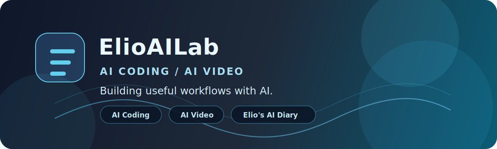

# ElioAILab

AI Coding and AI Video.

我是 Elio，一个长期研究 AI 编程和 AI 视频的创作者。国内平台全网同名「Elio的AI日记」，GitHub 用 `ElioAILab`，因为这里更像我的全球作品实验室。

我关注的不是“AI 又出了什么新概念”，而是两个更具体的问题：

- **AI Coding**：怎么用 AI 更快地写代码、做工具、搭工作流。
- **AI Video**：怎么用 AI 完成选题、脚本、分镜、素材、剪辑和发布。

<!-- PROFILE-BADGES-START -->

<!-- PROFILE-BADGES-END -->

---

### Main Tracks

**AI Coding · 用 AI 把想法做成工具**

我会把自己真实用过的 AI 编程方法、开发流程和踩坑记录下来。重点不是炫技，而是把一个想法从 0 到 1 做出来：需求怎么拆、代码怎么写、结果怎么测、哪里容易翻车。

**AI Video · 用 AI 重做内容生产流程**

我正在研究 AI 视频的完整链路：选题、资料整理、脚本、分镜、画面、配音、剪辑和多平台发布。我的目标不是做“看起来很 AI”的视频，而是让 AI 真正帮创作者提高产能和质量。

**Elio的AI日记 · 国内平台的内容主线**

公众号、B站、小红书、抖音都用这个名字。内容会更偏实操教程和真实记录：我用过什么、解决了什么问题、哪里不值得踩坑。

---

### What I Build Here

- AI coding workflows and small tools
- Video automation experiments
- Prompt templates that can survive real tasks
- Content production pipelines
- Notes from building with AI, not just reading about AI

---

### Principles

**Make it useful.** A workflow should help someone finish a real task, not only look good in a demo.

**Show the process.** Good results matter, but the steps, tradeoffs and mistakes are often more useful.

**Keep the boundary clear.** AI is a lever, not magic. I care about what can be checked, repeated and improved.

**Compound slowly.** 每天做一点正确的小事，让时间成为盟友。

---

### Stack And Interests

`AI Coding` · `AI Video` · `Prompt Engineering` · `Automation` · `Python` · `TypeScript` · `Markdown` · `Content Workflow` · `Indie Hacking`

---

### Find Me

**China platforms** · 全网同名「Elio的AI日记」

- **公众号** · [Elio的AI日记](https://weixin.sogou.com/weixin?type=1&query=Elio%E7%9A%84AI%E6%97%A5%E8%AE%B0)
- **B站** · [Elio的AI日记](https://search.bilibili.com/upuser?keyword=Elio%E7%9A%84AI%E6%97%A5%E8%AE%B0)
- **小红书** · [Elio的AI日记](https://www.xiaohongshu.com/search_result?keyword=Elio%E7%9A%84AI%E6%97%A5%E8%AE%B0)
- **抖音** · [Elio的AI日记](https://www.douyin.com/search/Elio%E7%9A%84AI%E6%97%A5%E8%AE%B0)

**GitHub** · [@shiyangye6](https://github.com/shiyangye6)

> Building an AI lab for coding, video and useful creative workflows.
